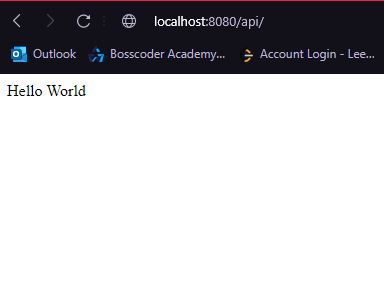
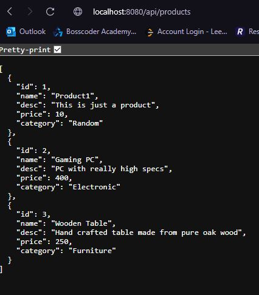
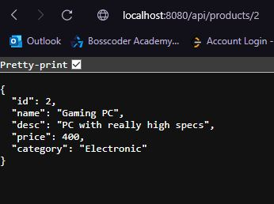

This project leverages the power of Spring Boot to create a basic backend API.

This API has three main endpoints for the user to hit; the first one being the main screen that can be accessed at '/api/':   

The second enpoint displays the data that is currently held in the database. This can be accessed at '/api/products':  

The third and final endpoint allows the user to specifically target a single product based on its ID. This is dynamic in that it takes in a specific ID as a part of the url. It can be accessed at '/api/products/[idNumber]':  

